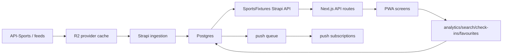

# SportsFixtures Postgres database map

This is the backend data map for the SportsFixtures PWA and Strapi API. The app currently calls Strapi collections from the Next API layer, so these tables can be implemented as Strapi content types backed by Postgres, or as direct Postgres tables if the backend team chooses to bypass Strapi for high-volume services.

## Principles

- Postgres is the system of record for users, sports taxonomy, events, venues, offers, campaigns, preferences, analytics, predictions, and push delivery state.
- Cloudflare R2 is the durable payload cache for repeated provider API calls. Postgres should keep cache metadata, audit rows, and invalidation state.
- Provider IDs must be stored separately from internal IDs. Never make API-Sports or legacy feed IDs the primary key.
- Most flexible provider payloads should land in `jsonb` columns while the fields needed for filtering/search are normalized.
- Use PostGIS for venues and geofence matching.
- Use `blocked` and `visibility_status` fields across taxonomy/content tables so operations can suppress forbidden or unsuitable records globally.

## Core ownership groups

### 1. Identity, device, consent, and account state

Required for login, anonymous device mode, terms/cookie acceptance, revenue-related default preferences, profile editing, and account deletion.

Tables:

- `app_users`: signed-in users and Strapi user mirror.
- `user_devices`: anonymous and signed-in devices, device token, platform, timezone, location permission state.
- `user_consents`: terms, cookies, analytics, affiliate tracking, location recommendations, marketing push/email.
- `user_sessions`: optional server session/audit layer if Strapi JWT is not enough.
- `account_deletion_requests`: deletion lifecycle and audit.

Key relationships:

- `app_users.id` -> many `user_devices.user_id`
- `app_users.id` or `user_devices.device_token` -> preferences, favourites, push, analytics

### 2. Sports taxonomy and provider mapping

Required for onboarding sports/countries/leagues/events, global search, fixture filters, standings, and provider routing.

Tables:

- `sports`: football, basketball, tennis, rugby, NFL, etc.
- `countries`: England, Scotland, Wales, USA, Thailand, etc. No UK bucket for the PWA rows.
- `competitions`: leagues, cups, events, tournaments.
- `competition_seasons`: season instances for standings and fixtures.
- `teams`: team master records.
- `players`: player master records.
- `venues_stadiums`: match stadiums, separate from watch venues/bars.
- `provider_entities`: maps internal IDs to API-Sports, SportsFixtures backend, and legacy provider IDs.
- `taxonomy_assets`: icons/logos/flags for sports, countries, competitions, teams, events.
- `taxonomy_visibility_rules`: global suppression rules, including blocked countries/teams/competitions.

High-priority indexes:

- `provider_entities(provider, entity_type, provider_entity_id)`
- `sports(slug)`, `countries(slug)`, `competitions(slug)`, `teams(slug)`
- trigram indexes on names for smart search

### 3. Fixtures, live scores, results, standings, and match intelligence

Required for live, fixtures, results, match detail tabs, H2H, datalytics, commentary, alerts, and pinned scores.

Tables:

- `events`: canonical fixtures/results.
- `event_status_snapshots`: latest and historical status/score snapshots.
- `event_timeline`: goals, cards, substitutions, VAR, kickoff/full-time, commentary events.
- `event_statistics`: possession, shots, corners, cards, offsides, xG-style values when available.
- `event_lineups`: confirmed/predicted lineups and formations.
- `event_tv_listings`: channels and online services per event/country/region.
- `event_highlights`: post-match video/highlight links.
- `event_weather`: expected weather and venue local conditions.
- `standings_tables`: competition/season table headers.
- `standings_rows`: rank, played, won, drawn, lost, goal difference, points, form.
- `head_to_head_records`: cached H2H summaries and recent meetings.
- `match_prediction_markets`: non-gambling prediction prompts and selectable outcomes.

Key relationships:

- `events.sport_id`, `events.competition_id`, `events.season_id`, `events.home_team_id`, `events.away_team_id`
- `event_*` tables reference `events.id`
- `standings_rows.team_id` references `teams.id`

### 4. Watch venues, food, offers, and venue intelligence

Required for Places to Watch, venues page, team/event search, food toggle, check-ins, smart TV-to-venue cross-pollination, and campaign targeting.

Tables:

- `watch_venues`: sports bars/restaurants/venues.
- `venue_opening_hours`: structured hours by day.
- `venue_screens`: screen/projector/channel capability.
- `venue_supported_sports`: venue can show these sports.
- `venue_supported_competitions`: venue can show these leagues/events.
- `venue_supported_teams`: team-affinity venue rows, e.g. Celtic bar.
- `venue_scheduled_events`: exact event shown at venue.
- `venue_food_profiles`: cuisine, food toggle, kitchen hours, menus.
- `venue_offers`: venue-local offers.
- `venue_checkins`: user/device check-ins.
- `venue_watchers`: "watching here" intent for upcoming/live events.
- `venue_recommendation_scores`: materialized matching result for user/event/venue.

PostGIS:

- `watch_venues.location geography(Point, 4326)`
- index with `gist(location)`

Smart matching inputs:

- favourite team
- exact event shown
- match kickoff time
- distance from user
- open now / kitchen open
- screens count
- active offer
- sponsorship boost
- check-ins / crowd score

### 5. Favourites, onboarding, personalization, and saved

Required for onboarding selections to populate Saved, home modules, recommendations, and alert defaults.

Tables:

- `user_favourites`: polymorphic saved entities: sport, country, competition, event, team, player, venue, news topic.
- `onboarding_interests`: raw onboarding choices and completion step.
- `user_preferences`: app preferences, theme, timezone, disco mode, default filters.
- `home_module_preferences`: personalised ordering and module visibility.
- `pinned_scores`: one-to-many home-screen score pins.

Important constraint:

- unique favourite per owner/entity: `(owner_type, owner_id, entity_type, entity_id)`

### 6. Push notifications, reminders, and delivery backend

Required for the full push repertoire: 1 day, 8h, 1h, 5m reminders, goals/cards, venue offers, partner offers, geofence offers, campaigns, delivery metrics, unsubscribe cleanup.

Tables:

- `push_subscriptions`: browser/native push endpoints.
- `notification_preferences`: global user/device notification settings.
- `notification_subscriptions`: entity subscriptions for teams, competitions, events, venues, news topics.
- `notification_history`: in-app notification list.
- `push_campaigns`: campaign definition for admin/operator panel.
- `push_campaign_targets`: target snapshot for a campaign.
- `push_delivery_jobs`: queue rows with scheduled time, status, retry count, duplicate key.
- `push_delivery_attempts`: provider send attempts and errors.
- `push_opens`: notification open/click metrics.
- `push_unsubscribes`: cleanup/audit rows.
- `push_audit_logs`: operator and system audit trail.

Must-have constraints:

- unique active subscription by endpoint
- unique delivery duplicate key for event/category/offset/subscription
- retry fields on delivery job

### 7. Commercial, subscriptions, VIP/founder, redeem codes, and ads

Required for Gold Launch Pass, Founder VIP, ads, affiliate cards, venue boosts, smart ad injections, and discount codes.

Tables:

- `membership_plans`: bronze/silver/gold/founder configuration.
- `user_memberships`: active membership state.
- `entitlements`: capability keys.
- `membership_entitlements`: plan-to-entitlement join.
- `redeem_codes`: codes for discounts/upgrades/add-ons.
- `redeem_code_redemptions`: who/device used each code.
- `commercial_campaigns`: operator-created offers/campaigns.
- `commercial_slots`: page position and audience rules.
- `commercial_impressions`: ad/offer impression events.
- `commercial_clicks`: ad/offer click events.
- `affiliate_partners`: partner metadata.
- `venue_boost_rules`: sponsored/organic boost control.

### 8. Analytics, BI, search, and measurement

Required for understanding user behaviour, search terms, page paths, dwell time, check-ins, venue intent, offers, and the broader Shozzle ecosystem.

Tables:

- `analytics_events`: generic event firehose.
- `analytics_sessions`: session start/end, referrer, device, geo summary.
- `search_queries`: global search terms, selected result, result counts.
- `page_views`: route-level dwell time and module engagement.
- `user_journeys`: optional derived journey/session path.
- `conversion_events`: premium, venue click, offer click, check-in, external click.
- `measurement_daily_rollups`: BI-ready aggregates.
- `cross_ecosystem_links`: ties SportsFixtures users/devices to Pattaya1, SportsBarz, GreatFoodPlaces events where consent allows.

Retention:

- Raw analytics: 90-180 days unless needed for audit.
- Aggregates: keep indefinitely.
- Respect deletion requests by user/device.

### 9. News, RSS, transfers, and exit gate

Required for news feed, breaking ticker, transfer section, external-link delay page, ad injection, and source attribution.

Tables:

- `news_sources`: RSS/API source registry.
- `news_articles`: normalized articles.
- `news_topics`: topic taxonomy, including transfers.
- `news_article_topics`: article-topic join.
- `news_exit_rules`: delay, ad slot, leave button behaviour by source/topic.
- `news_external_clicks`: click/open tracking.

### 10. Provider cache, API quota, and ingestion logs

Required to avoid duplicate API calls and coordinate API-Sports quota across sports.

Tables:

- `provider_cache_index`: metadata for R2 cache objects.
- `provider_requests`: every upstream request, status, duration, quota cost.
- `provider_quota_windows`: daily counters by provider/product/key.
- `provider_ingestion_runs`: cron/manual import jobs.
- `provider_ingestion_errors`: normalized error records.

R2 object key pattern:

```text
sportsfixtures-provider-cache/{provider}/{sha256(provider:endpoint)}.json
```

### 11. Admin/control plane

Required for operator-managed feature flags, homepage modules, ticker, tournament mode, campaign tools, role boundaries, and audit.

Tables:

- `feature_flags`
- `homepage_modules`
- `ticker_controls`
- `tournament_modes`
- `control_plane_snapshots`
- `admin_audit_logs`
- `operator_roles`
- `operator_role_assignments`

### 12. SEO and discoverability

Required for venue pages, articles, league/team SEO, IndexNow, stale page measurement.

Tables:

- `seo_pages`
- `seo_article_metadata`
- `seo_indexnow_submissions`
- `seo_quality_checks`
- `seo_discoverability_reports`

## Launch critical tables

For football launch, build these first:

1. `sports`, `countries`, `competitions`, `competition_seasons`, `teams`, `provider_entities`
2. `events`, `event_status_snapshots`, `event_timeline`, `event_statistics`, `standings_tables`, `standings_rows`, `event_tv_listings`
3. `watch_venues`, `venue_supported_teams`, `venue_supported_competitions`, `venue_scheduled_events`, `venue_offers`, `venue_checkins`
4. `user_devices`, `user_consents`, `user_favourites`, `onboarding_interests`, `user_preferences`
5. `push_subscriptions`, `notification_preferences`, `notification_subscriptions`, `push_delivery_jobs`, `push_delivery_attempts`, `push_opens`
6. `commercial_campaigns`, `commercial_slots`, `venue_boost_rules`, `redeem_codes`
7. `analytics_events`, `search_queries`, `page_views`, `provider_cache_index`, `provider_quota_windows`

## Data flow summary



